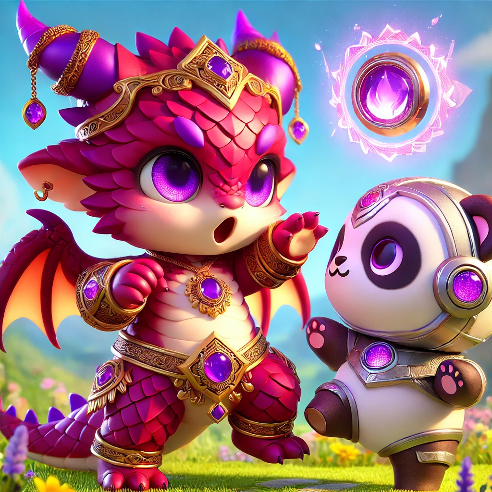

# Mrgll.Me - AI-Enhanced Pet Battle Stories



## Core Concept

Create an AI-powered platform that generates visually stunning and narrative-rich pet battle scenes while leveraging WowHead's comprehensive pet data.

## Key Features

### 1. Clean Pet Interface

-   Display essential pet stats and abilities
-   Prominent WowHead integration (`https://www.wowhead.com/npc=${creature.id}`) for detailed information
-   Let WowHead handle the comprehensive data (screenshots, 3D models, locations, etc.)

### 2. AI-Generated Battle Content

-   Image Generation
    -   Convert pet screenshots/models into detailed image prompts
    -   Generate battle scene images showing pet interactions
    -   Maintain consistent chibi/cute art style across generations
-   Battle Narratives
    -   Generate short stories about pet battles
    -   Include ability usage descriptions
    -   Create engaging battle commentary

### 3. Database Structure

-   Store curated image prompts derived from official pet visuals
-   Maintain ability descriptions and pet lore
-   Cache generated battle scenarios

### 4. Battle Scene Components

-   AI-generated battle scene image
-   Battle action descriptions (e.g., "Murkastrasza casts Living Flame on Stinker")
-   Short narrative about the battle
-   Links to WowHead for detailed pet information

### 5. User Integration

-   Optional OpenRouter account connection
    -   Allow users to generate their own battle scenes
    -   Users cover their own AI generation costs
    -   Default to pre-generated content for non-connected users

## Technical Implementation

### Current Progress

-   WoW API integration established
-   Pet data retrieval system in place
-   Access to creature IDs for WowHead linking

### Next Steps

1. Create image prompt database from pet visuals
2. Implement OpenRouter API integration
3. Design clean pet stats interface
4. Develop battle scene generation system
5. Build WowHead linking system

## Example Battle Scene

### Image Prompt Structure

```
Base Pet Description:
"A cute chibi-style baby dragon character with magenta-red scales and purple accents. The dragon has large, expressive golden eyes and small protruding fangs. Its body features ornate golden armor pieces and bands..."

Battle Action:
"[Base Pet] casts [Ability] on [Target Pet]..."
```

### Battle Components

1. Generated battle image
2. Action statement: "Murkastrasza casts Living Flame on Stinker"
3. Battle narrative
4. WowHead links for both pets

## Future Possibilities

-   Battle history archive
-   Favorite battle scene collections
-   Community prompt improvements
-   Seasonal themed battles
